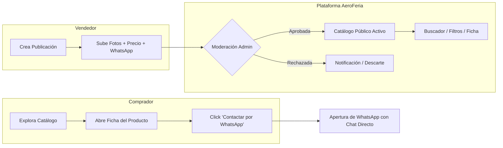

# Documento de Visión y Alcance (Vision & Scope)
**Proyecto:** AeroFeria — Marketplace de Compra-Venta para Aeromodelismo  
**Autor:** Analista de Sistemas Senior  
**Estado:** Aprobado para Fase de Diseño  
**Versión:** 1.0  

---

## 1. Contexto y Planteamiento del Problema

El aeromodelismo (aviones radio-controlados, planeadores, helicópteros, drones FPV, turbinas y accesorios) es una disciplina técnica y de nicho con un mercado secundario muy dinámico. Actualmente, la comunidad en Argentina y la región canaliza el 90% de sus transacciones a través de grupos cerrados de **WhatsApp**.

### Problemáticas actuales del canal WhatsApp:
1. **Volatilidad y Pérdida de Información:** Los mensajes se pierden en el feed diario de cientos de mensajes de chat; las publicaciones quedan obsoletas o enterradas en horas.
2. **Imposibilidad de Búsqueda Estructurada:** No existe manera de filtrar por categoría (p. ej., "baterías LiPo 4S", "motores brushless", "radios FrSky/Futaba"), rango de precios ni condición (nuevo/usado).
3. **Falta de Estandarización:** Cada vendedor publica con formatos heterogéneos, fotos comprimidas de mala calidad y sin especificar claramente moneda, medios de pago o ubicación.
4. **Fricción de Moderación:** En los grupos de WhatsApp, los administradores sufren spam, estafas, duplicación constante de ofertas y falta de control sobre artículos ya vendidos.

---

## 2. Visión del Producto

> **AeroFeria** es una plataforma web especializada, minimalista y de alto rendimiento que centraliza el catálogo de oferta y demanda de aeromodelismo, combinando la organización y elegancia de un e-commerce moderno estilo **Apple** con la inmediatez de cierre de ventas directa vía **WhatsApp**.

El usuario disfruta de una experiencia limpia, visual y sin comisiones de pasarelas de pago, mientras que el administrador cuenta con un control total de moderación y auditoría de contenidos.

---

## 3. Alcance del Sistema (Scope Baseline)

Para garantizar un lanzamiento ágil (MVP) y escalable, se define con rigurosidad qué entra en el alcance, qué queda excluido y cómo opera la plataforma.

### 3.1. Qué HACE el Sistema (In-Scope)
* **Gestión de Catálogo y Publicaciones:**
  * Publicación con: título conciso, categoría técnica, descripción detallada, galería de imágenes optimizadas (hasta 5-8 fotos), enlace opcional de video (YouTube/Vimeo para demostración de vuelo o funcionamiento de motor), precio con selector bimonetario (**ARS** o **USD**), y estado del artículo (Nuevo, Como Nuevo, Usado en Excelente Estado, Para Repuestos).
  * Posibilidad para el vendedor de pausar, editar o marcar como **"VENDIDO"** su publicación.
* **Búsqueda y Exploración Optimizada:**
  * Buscador semántico en tiempo real por palabra clave.
  * Filtros facetados: Categoría (Modelos Completos, Radios/Receptores, Motores Glow/Gasolina/Eléctricos, Electrónica/Baterías, Repuestos/Accesorios), Condición, Rango de Precio y Moneda.
  * Ordenamiento por fecha de publicación (más recientes), menor/mayor precio.
* **Puente de Contacto WhatsApp (WhatsApp Bridge):**
  * Botón directo con deep-link a la API de WhatsApp (`wa.me/<telefono>?text=...`) que preconfigura un mensaje cordial y contextualizado: *"Hola! Vi tu publicación '[Título]' en AeroFeria por [Precio] [Moneda]. ¿Sigue disponible?"*.
* **Perfiles de Usuario con Foto de Perfil (Avatar):**
  * Posibilidad de cargar fotografía de perfil optimizada a WebP para que las publicaciones exhiban la identidad del vendedor, aumentando la transparencia y confianza en las transacciones comunitarias.
* **Directorio y Vitrinas de Tiendas Oficiales de RC (Hobby Shops):**
  * Perfiles dedicados para tiendas de referencia (ej. *HobbyMotors*, *AeroJols*, *DynaHobbies*).
  * Landing page propia para cada tienda (`/tiendas/:slug`) con identidad visual (logo, header panorámico estilo Apple Store, marcas que representa como Futaba, OS Engine, Spektrum, FrSky, dirección física, horarios, web oficial, Instagram y WhatsApp directo).
  * Catálogo filtrado exclusivo con todos los artículos de dicha tienda.
  * Insignia distintiva de **"Tienda Oficial Verificada"** en las tarjetas del catálogo general.
* **Panel de Administración Aislado y Seguro:**
  * Acceso restringido exclusivamente al Administrador de la plataforma (`ROLE_ADMIN`).
  * **Aislamiento estricto:** El código, rutas y componentes del panel jamás son cargados ni descargados por usuarios comunes (separación de chunks en cliente y guards de ruta `canMatch`).
  * Tablero con métricas clave y funciones de moderación: Aprobar, Rechazar con motivo, Editar categorías y Gestionar Tiendas Oficiales.
* **Arquitectura BFF y Escudo Nginx (Zero Backend Direct Exposure):**
  * Patrón **BFF (Backend-For-Frontend)** con endpoints optimizados para mobile/desktop que evitan el overfetching.
  * **Nginx Reverse Proxy:** Único componente expuesto a internet (puertos 80 y 443). El backend Java Spring Boot corre en red interna privada Docker sin mapeo de puertos hacia el exterior.
  * Entrega estática acelerada de imágenes WebP directamente desde Nginx.

---

### 3.2. Qué NO HACE el Sistema (Out-of-Scope — MVP)
* **NO procesa pagos ni pasarelas de cobro:** No se integra Mercado Pago, Stripe ni transferencias en la plataforma. La negociación y el pago se acuerdan entre particulares o directamente con el mostrador/WhatsApp de la tienda. Esto elimina responsabilidades fiscales, comisiones financieras y complejidad de reembolsos.
* **NO gestiona envíos ni logística integrada:** No se calcula costo de flete ni se generan etiquetas de Correo Argentino/Andreani; el envío se pacta de forma privada entre comprador y vendedor o tienda.
* **NO contiene un sistema de chat interno:** Evitamos la sobrecarga de mantener WebSockets de mensajería redundante; se delega la comunicación directa en WhatsApp, que ya es la herramienta de cabecera de los aeromodelistas.
* **NO es una subasta:** Los precios son fijos o negociables fuera de plataforma; no hay pujas temporizadas ni reservas automáticas con seña.
* **NO incluye pasarela de cobro B2B ni facturación fiscal automática para tiendas:** La habilitación y verificación de Tiendas Oficiales es gestionada manualmente por el Administrador en esta fase.

---

## 4. Cómo lo Hace (Mecánica Operativa)

1. **Ingreso y Publicación:** El aeromodelista crea su aviso completando un formulario intuitivo de una sola página o wizard de 2 pasos.
2. **Curaduría y Moderación:** El administrador valida que el contenido corresponda a aeromodelismo legítimo (evitando spam o artículos no relacionados).
3. **Descubrimiento:** Los compradores filtran con precisión de milisegundos gracias al frontend reactivo en Angular.
4. **Conversión:** Un simple tap conecta al interesado con el vendedor con contexto inmediato, cerrando la brecha entre catálogo web organizado y canal de mensajería predilecto.
