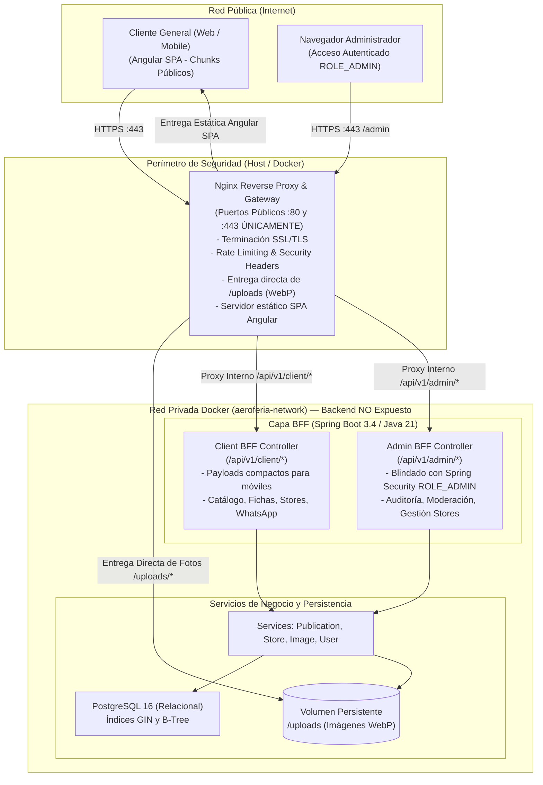

# Arquitectura Técnica y Stack Tecnológico
**Proyecto:** AeroFeria — Marketplace de Compra-Venta para Aeromodelismo  
**Perfil:** Analista de Sistemas Senior  
**Versión:** 1.0  

---

## 1. Visión General de la Arquitectura

AeroFeria implementa una **Arquitectura Desacoplada con Patrón BFF (Backend-For-Frontend)** y un **Escudo Perimetral Nginx**, diseñada para:
1. **Velocidad y Adaptabilidad Responsive:** Entregar cargas útiles (payloads JSON) estrictamente dimensionadas para mobile y desktop sin sobre-procesamiento (overfetching).
2. **Aislamiento Total del Panel de Administrador:** Garantizar que ningún usuario general cargue en su navegador los bundles de código, rutas o estructuras del panel de administración.
3. **Seguridad y Cero Exposición del Backend:** Spring Boot nunca se expone a internet; solo es accesible a través de la red interna privada de Docker mediante Nginx.



---

## 2. Stack Tecnológico Detallado

### 2.1. Backend (Servicios de Aplicación y API REST)
* **Lenguaje:** **Java 21 (LTS)** — Aprovechando Virtual Threads (Project Loom) para concurrencia liviana y pattern matching moderno.
* **Framework:** **Spring Boot 3.4+**
  * `spring-boot-starter-web`: Exposición de endpoints RESTful.
  * `spring-boot-starter-security`: Seguridad basada en filtros sin estado (Stateless), validación de tokens JWT.
  * `spring-boot-starter-data-jpa`: Capa de abstracción sobre Hibernate ORM.
  * `spring-boot-starter-validation`: Validación declarativa de DTOs (`@NotNull`, `@Size`, `@Positive`, etc.).
  * `jjwt` (Java JWT): Generación y verificación criptográfica de tokens.
  * `twelvemonkeys-imageio` / `imgscalr`: Compresión y conversión de imágenes a WebP en el servidor.
* **Estructura de Paquetes en Backend (Clean Layered Architecture):**
  ```
  com.aeroferia.api
  ├── config/          # Spring Security, CORS, JWT Filter, WebMvcConfig
  ├── controller/      # Endpoints REST: Auth, Publication, Category, Store, Admin
  ├── dto/             # Data Transfer Objects (Request / Response payloads)
  ├── entity/          # Entidades JPA: User, Publication, Category, Store, Image, etc.
  ├── exception/       # Manejador global de excepciones (@ControllerAdvice)
  ├── repository/      # Interfaces Spring Data JPA con query methods optimizados
  ├── service/         # Lógica de negocio e interfaces de servicio
  │   └── impl/        # Implementación concreta de servicios
  └── util/            # Helpers de formateo, slug generators, manipulación de archivos
  ```

---

### 2.2. Frontend (Single Page Application - SPA)
* **Framework:** **Angular 19+ / 20+**
  * Arquitectura basada en **Standalone Components** (eliminación de NgModules tradicionales).
  * **Signals Reactivos:** Uso de `signal()`, `computed()`, y `effect()` para un manejo de estado local hiper-reactivo y predecible.
  * **Estrategia de Change Detection OnPush:** Rendimiento nativo sin ciclos redundantes de renderizado.
  * **Control Flow Moderno:** Nuevas directivas integradas `@if`, `@for`, `@switch`.
  * **Angular Router:** Lazy loading por rutas para carga inicial ultrarrápida (menos de 150 KB gzipped).
* **Estilos y Sistema de Diseño:**
  * **Tailwind CSS v3.4+ / v4**: Utilidades atómicas configuradas con la paleta y radios de curvatura inspirados en Apple (espaciados generosos, `backdrop-blur-md`, transiciones `transition-all duration-200 ease-out`).
  * **Tipografía:** SF Pro Display / Inter (`font-sans`), con tracking estricto y jerarquía limpia.
  * **Iconografía:** Lucide Angular o Heroicons (trazos limpios de 1.5px / 2px).
* **Estructura de Carpetas en Frontend:**
  ```
  src/app/
  ├── core/            # Servicios singleton (Auth, Interceptores HTTP, Guards)
  ├── shared/          # Componentes reutilizables (Botón Apple, Modal, Input, Badge, Header, Footer)
  ├── features/        # Módulos funcionales autocontenidos:
  │   ├── catalog/     # Listado principal, grilla de productos, barra de filtros y búsqueda
  │   ├── product/     # Ficha de detalle del producto, galería lightbox, botón WhatsApp
  │   ├── stores/      # Directorio de Tiendas (/tiendas) y Vitrina de Tienda (/tiendas/:slug)
  │   ├── publish/     # Formulario de publicación y carga de fotos (drag & drop)
  │   ├── admin/       # Panel de moderación exclusivo, gestión de tiendas, métricas
  │   └── auth/        # Pantallas de Login y Registro minimalistas
  └── assets/          # Logos SVG, íconos y placeholders
  ```

---

### 2.3. Patrón BFF (Backend-For-Frontend) & Aislamiento del Panel de Administrador

El patrón BFF en AeroFeria resuelve dos objetivos arquitectónicos de primer orden:

#### 1. Optimización Responsive y Eliminación de Overfetching (Client BFF)
* **Mobile-First Data Contracts:** Los dispositivos móviles en redes celulares no deben descargar campos innecesarios. El `ClientBFFController` expone proyecciones ultra-livianas:
  * `PublicationCardDto`: Solo ID, título recortado, thumbnail WebP, precio/moneda, badge de condición y badge de tienda verificada (~350 bytes por item).
  * `PublicationDetailDto`: Carga completa bajo demanda con galería, video embed y botón directo de WhatsApp.
  * `StorefrontDto`: Agrega datos del comercio, marcas oficiales que representa, header y catálogo de la tienda en una sola llamada de red.

#### 2. Aislamiento Estricto del Panel de Administrador (Admin Isolation)
Para garantizar que **un usuario común jamás cargue ni descargue el código del panel de Administrador**:
* **Aislamiento en Frontend (Angular Code-Splitting & `canMatch` Guard):**
  * La ruta `/admin` está empaquetada en un chunk JavaScript independiente (`admin-chunk.js`) separado físicamente del bundle principal (`main.js`).
  * Se implementa un guard funcional de coincidencia de ruta:
    ```typescript
    // admin.routes.ts
    export const ADMIN_ROUTES: Routes = [
      {
        path: 'admin',
        canMatch: [() => inject(AuthService).isAdmin()],
        loadChildren: () => import('./features/admin/admin.routes')
      }
    ];
    ```
  * **Comportamiento:** Si un visitante o vendedor estándar navega a `/admin`, Angular rechaza el match de la ruta y redirige a `404 Not Found` sin si quiera descargar el chunk administrativo de la red.
* **Aislamiento en Backend (Spring Security & Admin BFF):**
  * Todos los endpoints administrativos se agrupan bajo `/api/v1/admin/**`.
  * La cadena de filtros de seguridad (`SecurityFilterChain`) intercepta cualquier petición a este prefijo antes del dispatcher, exigiendo token JWT válido con claim `roles: ['ROLE_ADMIN']`. Las peticiones no autorizadas reciben inmediatamente `403 Forbidden` sin ejecutar lógica de controladores.

---

### 2.4. Escudo Perimetral Nginx & Cero Exposición del Backend

El backend Java Spring Boot **nunca se expone directamente a internet**, blindándolo contra escaneos de puertos y ataques de denegación de servicio.

#### 1. Aislamiento de Red en Docker
* **Red Privada Interna (`aeroferia-network`):** El contenedor `aeroferia-backend` utiliza la directiva `expose: - 8080` (accesible únicamente para otros contenedores en la misma red Docker), **eliminando cualquier mapeo de puertos hacia el host exterior (`ports: - "8080:8080"` NO existe)**.
* **Único Punto de Ingress:** El contenedor Nginx (`aeroferia-proxy`) es el único servicio con puertos abiertos hacia internet (`80` HTTP con redirección automática a `443` HTTPS).

#### 2. Distribución de Carga y Optimización de Medios en Nginx
```nginx
# Fragmento de nginx.conf
server {
    listen 80;
    server_name aeroferia.com;
    return 301 https://$host$request_uri;
}

server {
    listen 443 ssl http2;
    server_name aeroferia.com;

    # Certificados SSL y Ciphers modernos
    ssl_certificate /etc/letsencrypt/live/aeroferia.com/fullchain.pem;
    ssl_certificate_key /etc/letsencrypt/live/aeroferia.com/privkey.pem;

    # Headers de Seguridad Apple-grade
    add_header X-Frame-Options "SAMEORIGIN" always;
    add_header X-Content-Type-Options "nosniff" always;
    add_header Referrer-Policy "strict-origin-when-cross-origin" always;
    server_tokens off;

    # 1. Entrega Directa de Medios WebP (Bypass del Backend para máxima velocidad)
    location /uploads/ {
        alias /app/uploads/;
        expires 1y;
        add_header Cache-Control "public, max-age=31536000, immutable";
        access_log off;
    }

    # 2. Proxy Inverso hacia Capa BFF Spring Boot (Red interna Docker)
    location /api/ {
        limit_req zone=api_limit burst=20 nodelay;
        proxy_pass http://aeroferia-backend:8080;
        proxy_set_header Host $host;
        proxy_set_header X-Real-IP $remote_addr;
        proxy_set_header X-Forwarded-For $proxy_add_x_forwarded_for;
        proxy_set_header X-Forwarded-Proto $scheme;
    }

    # 3. Servidor de Archivos Estáticos SPA Angular
    location / {
        root /usr/share/nginx/html;
        index index.html;
        try_files $uri $uri/ /index.html;
        gzip_static on;
    }
}
```

---

### 2.5. Persistencia y Almacenamiento
* **Base de Datos:** **PostgreSQL 16 (Relacional)**
  * Soporte robusto de transacciones ACID.
  * Índices B-Tree en campos de filtrado clave (`category_id`, `status`, `price`, `currency`, `store_id`, `created_at`).
  * Búsqueda por texto mediante índices `GIN` o `tsvector` para coincidencia rápida de títulos y marcas aeromodelistas (Futaba, OS Engine, E-flite, etc.).
* **Almacenamiento de Archivos (Media Storage):**
  * Para el entorno local y VPS: Volumen persistente en disco administrado por Nginx.
  * Abstracción mediante interfaz `StorageService` en Spring Boot (permite cambiar a AWS S3 / Cloudinary en el futuro sin modificar la lógica de negocio).

---

### 2.6. Estrategia de Contenerización (Docker & Docker Compose)

El sistema completo se levanta con un único comando: `docker compose up -d`.

#### Configuración de Servicios en Docker:
1. **`aeroferia-db` (PostgreSQL 16):**
   * Red interna `aeroferia-network`. Puerto 5432 no expuesto al exterior.
   * Volumen de persistencia: `pg_data:/var/lib/postgresql/data`.
2. **`aeroferia-backend` (Spring Boot API & BFF):**
   * Java 21, runtime liviano multi-stage build.
   * **Sin mapeo de puertos hacia el host** (`expose: - 8080`).
   * Volumen compartido de medios: `uploads_data:/app/uploads`.
3. **`aeroferia-frontend` (Angular 19+ SPA Build):**
   * Multi-stage build compilado a HTML/JS/CSS minificado estático.
4. **`aeroferia-proxy` (Nginx Gateway Perimetral):**
   * Único contenedor con puertos públicos (`80:80`, `443:443`).
   * Monta los archivos estáticos del frontend compilado y el volumen `uploads_data`.
   * Enruta `/api` internamente al backend.
