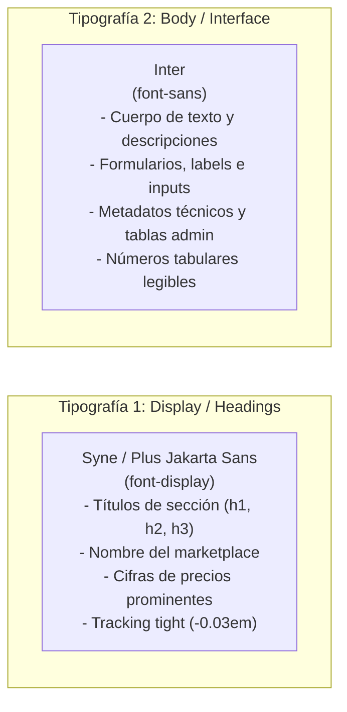

# Guía de Diseño UI/UX — Identidad Visual, Tipografía y Sistema de Movimiento
**Proyecto:** AeroFeria — Marketplace de Compra-Venta para Aeromodelismo  
**Perfil:** Analista de Sistemas Senior & Lead UI/UX Designer  
**Versión:** 2.0 (High-Tech Carbon & Fluor Yellow Edition)  

---

## 1. Directivas Obligatorias de Estilo

### 1.1. Regla de Oro: Prohibición Total de Emojis (Zero Emojis Policy)
* **Queda estrictamente prohibido el uso de emojis Unicode (`✈️`, `🔥`, `🏷️`, `📦`, `✅`, etc.) en cualquier parte de la interfaz**, incluyendo títulos, botones, badges, modales, alertas o placeholders.
* **100% Iconografía Vectorial SVG:** Toda señalética visual debe ser implementada mediante **iconos SVG vectoriales limpios** (familia Lucide Icons o SVG inline) con grosor de trazo uniforme (*stroke-width: 1.5px / 2px*), garantizando una estética técnica, sobria y profesional de nivel Apple/Aeronáutico.

---

### 1.2. Sistema de Color Bimodal: Blanco Puro & Negro Carbón con Amarillo Flúor

La paleta se inspira en la ingeniería de competición y los composites de fibra de carbono utilizados en los aeromodelos de alto rendimiento:

```
┌────────────────────────────────────────────────────────────────────────┐
│                        PALETA CROMÁTICA OFICIAL                        │
├────────────────────────────────┬───────────────────────────────────────┤
│ MODO CLARO (Light Mode)        │ MODO OSCURO (Dark Mode)               │
├────────────────────────────────┼───────────────────────────────────────┤
│ • Fondo Base: Blanco Puro      │ • Fondo Base: Negro Carbón Mate       │
│   (#FFFFFF / #F8F8F9)          │   (#0A0A0B / #121214 / #18181B)       │
│ • Superficies: Blanco Vidrio   │ • Superficies: Vidrio Carbón          │
│   (bg-white/80 backdrop-blur)  │   (bg-zinc-900/70 backdrop-blur-xl)   │
│ • Texto Principal: Zinc 950    │ • Texto Principal: Blanco Zinc 50     │
│   (#09090B)                    │   (#FAFAFA)                           │
├────────────────────────────────┴───────────────────────────────────────┤
│ ACENTO ENERGÉTICO UNIVERSAL: Amarillo Flúor (Electric Fluor Volt)      │
│ • Color: #D4FF00 (Hex) / #CCFF00 (Hover)                              │
│ • Función: Botones primarios, foco interactivo, badges de alta         │
│   relevancia, halos sutiles y tags destacados.                        │
│ • Accesibilidad: Texto interior siempre en Negro Carbón (#0A0A0B)      │
│   para garantizar ratio de contraste AAA (> 12:1).                     │
├────────────────────────────────────────────────────────────────────────┤
│ ACENTO DE CONVERSIÓN: Verde WhatsApp (#25D366)                        │
│ • Exclusivo y reservado para el CTA de contacto directo.               │
└────────────────────────────────────────────────────────────────────────┘
```

---

### 1.3. Las 2 Familias Tipográficas Oficiales

Para preservar pureza visual y máxima coherencia, la plataforma utiliza **exactamente dos tipografías**:



1. **Tipografía Display (`font-display`):** `Syne` (con fallback a `Plus Jakarta Sans`, `sans-serif`).
   * **Uso:** Logotipo "AeroFeria", encabezados de sección, nombres de modelos (ej. *Extra 330SC 35%*), banners y números de precio principales. Transmite potencia, dinamismo aerodinámico y modernidad.
2. **Tipografía de Interfaz (`font-sans`):** `Inter` (con fallback a `-apple-system, BlinkMacSystemFont, sans-serif`).
   * **Uso:** Todo el texto de lectura, especificaciones técnicas de motores/baterías, selectores, breadcrumbs, formularios y tablas del panel de administración. Optimizado para legibilidad extrema en pantallas móviles.

---

### 1.4. Doctrina de Movimiento: "Todo Debe Tener Animaciones" (Motion System)

Cada elemento interactivo debe responder a la física con naturalidad y fluidez:

| Tipo de Animación | Propiedades CSS / Tailwind | Curva & Duración | Propósito UX |
| :--- | :--- | :--- | :--- |
| **Tap / Click Feedback** | `active:scale-[0.97]` | `cubic-bezier(0.2, 0.8, 0.2, 1)` (150ms) | Sensación táctil de pulsador físico en botones y cards. |
| **Elevación de Card** | `hover:-translate-y-1.5 hover:shadow-2xl hover:border-fluor/40` | `ease-out` (250ms) | El producto se "despega" hacia el usuario al pasar el cursor. |
| **Entrada Escalonada (Stagger)** | `opacity-0 translate-y-3 -> opacity-100 translate-y-0` | Stagger incremental `50ms` por card | Carga suave del catálogo como una cascada elegante. |
| **Apertura de Modales** | `scale-95 opacity-0 -> scale-100 opacity-100` | Spring Apple `cubic-bezier(0.16, 1, 0.3, 1)` (300ms) | Diálogos que brotan con suavidad desde el centro. |
| **Transición Modo Día/Noche**| `transition-colors duration-300` | `ease-in-out` | Cambio orgánico de fondo blanco a negro carbón. |
| **Skeleton Pulse Flúor** | `animate-pulse bg-zinc-200 dark:bg-zinc-800` | 1.5s loop | Estados de carga con reflejo sutil de amarillo flúor. |

---

## 2. Configuración de Tokens en Tailwind CSS

```javascript
// tailwind.config.js
module.exports = {
  darkMode: 'class',
  theme: {
    extend: {
      colors: {
        // Amarillo Flúor de Alto Rendimiento
        fluor: {
          DEFAULT: '#D4FF00',
          hover: '#C2EB00',
          light: '#E6FF4D',
          glow: 'rgba(212, 255, 0, 0.25)'
        },
        // Negro Carbón Mate para Modo Oscuro
        carbon: {
          950: '#0A0A0B', // Fondo más profundo
          900: '#121214', // Fondos de tarjetas elevadas
          850: '#18181B', // Superficies y controles
          800: '#27272A', // Bordes sutiles
          border: 'rgba(255, 255, 255, 0.08)'
        },
        // Verde Oficial de Conversión WhatsApp
        whatsapp: {
          DEFAULT: '#25D366',
          hover: '#20BD5A'
        }
      },
      fontFamily: {
        display: ['Syne', 'Plus Jakarta Sans', 'sans-serif'],
        sans: ['Inter', '-apple-system', 'BlinkMacSystemFont', 'sans-serif']
      },
      borderRadius: {
        'apple-sm': '10px',
        'apple-md': '16px',
        'apple-lg': '24px',
        'apple-xl': '32px'
      },
      boxShadow: {
        'fluor-glow': '0 0 20px rgba(212, 255, 0, 0.35)',
        'apple-card': '0 4px 24px -1px rgba(0, 0, 0, 0.06), 0 2px 8px -1px rgba(0, 0, 0, 0.04)',
        'apple-card-dark': '0 4px 24px -1px rgba(0, 0, 0, 0.4), 0 2px 8px -1px rgba(0, 0, 0, 0.2)'
      }
    }
  }
}
```

---

## 3. Especificación de Componentes con Animaciones

### 3.1. Barra de Navegación (Header con Vidrio Esmerilado)
* **Estilo:**
  * Modo Claro: `bg-white/80 backdrop-blur-xl border-b border-black/[0.06]`
  * Modo Oscuro: `bg-carbon-950/80 backdrop-blur-xl border-b border-white/[0.08]`
* **Contenido:**
  * **Logo AeroFeria:** Texto en `font-display font-bold tracking-tight text-xl` con punto flúor animado (`<span class="inline-block w-2 h-2 rounded-full bg-fluor ml-1 animate-pulse"></span>`).
  * **Botón + Publicar:** Botón redondeado en amarillo flúor de alta energía:
    ```html
    <button class="flex items-center gap-2 px-5 py-2.5 rounded-full bg-fluor text-carbon-950 font-display font-bold text-sm tracking-wide shadow-fluor-glow hover:bg-fluor-hover active:scale-[0.96] transition-all duration-200">
      <!-- Icono SVG de Plus (Cero emojis) -->
      <svg class="w-4 h-4 stroke-current stroke-[2.5]" viewBox="0 0 24 24" fill="none" stroke="currentColor">
        <path d="M12 5v14M5 12h14" stroke-linecap="round" stroke-linejoin="round"/>
      </svg>
      <span>Publicar</span>
    </button>
    ```

---

### 3.2. Card de Producto (Apple Card con Borde Sensible y Micro-elevación)
* **Contenedor:**
  ```html
  <div class="group relative rounded-apple-lg overflow-hidden bg-white dark:bg-carbon-900 border border-black/[0.06] dark:border-carbon-border transition-all duration-300 ease-out hover:-translate-y-1.5 hover:shadow-2xl hover:border-fluor/50">
  ```
* **Elementos Clave:**
  * **Imagen del Modelo:** Proporción 4:3 con zoom fluido en hover (`group-hover:scale-105 transition-transform duration-500 ease-out`).
  * **Pill de Condición:** Chip translúcido con icono SVG de escudo o engranaje técnico.
  * **Badge de Tienda Oficial:**
    ```html
    <span class="inline-flex items-center gap-1 px-2.5 py-1 rounded-full bg-fluor text-carbon-950 text-xs font-display font-bold uppercase tracking-wider shadow-sm">
      <svg class="w-3.5 h-3.5 stroke-current stroke-[2.5]" viewBox="0 0 24 24" fill="none"><path d="M20 6L9 17l-5-5"/></svg>
      HobbyMotors
    </span>
    ```
  * **Precio:** Tipografía `font-display font-extrabold text-2xl text-zinc-950 dark:text-white tracking-tight`.

---

### 3.3. Botón Hero de WhatsApp (Máxima Conversión)
* **Diseño e Interacción:**
  ```html
  <a href="..." class="relative group w-full flex items-center justify-center gap-3 py-4 px-6 rounded-full bg-whatsapp hover:bg-whatsapp-hover text-white font-sans font-semibold text-base shadow-lg shadow-emerald-500/20 active:scale-[0.97] transition-all duration-200 overflow-hidden">
    <!-- SVG Icono WhatsApp oficial (Sin emojis) -->
    <svg class="w-5 h-5 fill-current" viewBox="0 0 24 24">
      <path d="M.057 24l1.687-6.163c-1.041-1.804-1.588-3.849-1.587-5.946.003-6.556 5.338-11.891 11.893-11.891 3.181.001 6.167 1.24 8.413 3.488 2.245 2.248 3.481 5.236 3.48 8.414-.003 6.557-5.338 11.892-11.893 11.892-1.99-.001-3.951-.5-5.688-1.448l-6.305 1.654z..."/>
    </svg>
    <span>Consultar por WhatsApp</span>
  </a>
  ```

---

### 3.4. Vitrina de Tienda Oficial (`/tiendas/:slug`)
* **Header Panorámico:** Portada de 280px con efecto parallax sutil y marco inferior redondeado (`rounded-b-apple-xl`).
* **Marcas Representadas (Fila Flúor Interactiva):**
  * Chips con borde carbón y hover reactivo en amarillo flúor:
  ```html
  <button class="px-4 py-1.5 rounded-full text-xs font-display font-bold border border-zinc-300 dark:border-zinc-700 bg-white dark:bg-carbon-850 text-zinc-800 dark:text-zinc-200 hover:border-fluor hover:text-fluor active:scale-95 transition-all duration-200">
    Futaba
  </button>
  ```

---

### 3.5. Avatar de Usuario (Monograma Apple sin Emojis)
* **Si tiene foto:** ``
* **Si no tiene foto (Fallback tipográfico):**
  ```html
  <div class="w-10 h-10 rounded-full flex items-center justify-center bg-carbon-900 text-fluor font-display font-bold text-sm ring-1 ring-white/10">
    TK
  </div>
  ```
