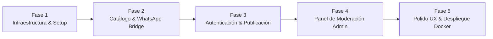

# Plan de Proyecto, Fases de Desarrollo y Roadmap MVP
**Proyecto:** AeroFeria — Marketplace de Compra-Venta para Aeromodelismo  
**Perfil:** Analista de Sistemas Senior  
**Versión:** 1.0  

---

## 1. Estrategia de Entrega: Enfoque MVP Ágil

Para validar rápidamente la adopción dentro de los clubes de aeromodelismo y grupos de WhatsApp, el desarrollo se divide en **5 fases incrementales**, asegurando software funcional desde las etapas tempranas.

---

## 2. Desglose de Fases

### Fase 1: Cimientos de Arquitectura, Nginx Shield e Infraestructura
* **Objetivo:** Disponer del entorno Dockerizado seguro con Nginx como proxy perimetral (puertos 80/443 únicamente), Spring Boot en red privada sin exposición pública, Angular y PostgreSQL.
* **Entregables:**
  * Configuración de `docker-compose.yml` blindado con red privada `aeroferia-network`.
  * Configuración `nginx.conf` con reverse proxy a `/api`, entrega directa de `/uploads/` (WebP) y headers de seguridad.
  * Proyecto Spring Boot 3.4+ (Java 21) con capas BFF (`ClientBFFController` y `AdminBFFController`).
  * Proyecto Angular 19+ standalone con Tailwind CSS, paleta Apple y estructura de rutas aisladas.
  * Scripts de migración inicial de base de datos (`users` con avatar, `stores` con marcas/header, `categories`, `publications`, `publication_images`).
  * Carga de datos semilla (Seed Data): Categorías técnicas, comercios iniciales (ej. HobbyMotors con marcas Futaba/OS/Spektrum) y usuario Administrador.

### Fase 2: Catálogo Público, Client BFF, Tiendas y Puente WhatsApp (Core Value)
* **Objetivo:** Cualquier visitante puede explorar modelos, filtrar por marcas, comercios o particulares y abrir el chat de WhatsApp con transferencias de datos hiper-livianas.
* **Entregables:**
  * Endpoints Client BFF de lectura optimizados para móvil/escritorio:
    * `GET /api/v1/client/publications` (payload liviano < 400B con filtros de categoría, marcas, tiendas, precio, moneda).
    * `GET /api/v1/client/publications/{id-o-slug}` (detalle completo con fotos, avatar de vendedor, video y botón WhatsApp).
    * `GET /api/v1/client/categories` (árbol de taxonomía).
    * `GET /api/v1/client/stores` y `GET /api/v1/client/stores/{slug}` (vitrina con header panorámico, marcas oficiales y stock).
  * Frontend:
    * Layout principal estilo Apple con Header translúcido y avatar de usuario.
    * Grilla reactiva de cards de producto con badge de **"Tienda Oficial Verificada"** y fotos WebP servidas desde Nginx.
    * Barra de búsqueda reactiva y chips horizontales de categorías y marcas.
    * Vista de Detalle (`ProductDetailComponent`) con galería de fotos, embed de video y botón de WhatsApp.
    * Directorio de Tiendas (`/tiendas`) y Vitrina de Tienda (`/tiendas/:slug`) con Header panorámico e inventario.

### Fase 3: Autenticación, Avatar y Flujo de Publicación para Vendedores y Comercios
* **Objetivo:** Los aeromodelistas y las tiendas asociadas pueden registrarse, subir foto de perfil / header y dar de alta productos.
* **Entregables:**
  * Backend:
    * Módulo de seguridad Spring Security + JWT (`/api/v1/auth/register`, `/api/v1/auth/login`).
    * Servicio de almacenamiento y compresión de fotos a formato WebP (`StorageService`) para fotos de producto, avatar de usuario y header de tienda.
    * Endpoint `POST /api/v1/client/publications` (asociación automática a `store_id` si el usuario gestiona un comercio).
    * Endpoint para actualizar avatar de usuario (`PUT /api/v1/client/profile/avatar`).
    * Endpoint para que el vendedor o tienda marque como vendido (`PATCH /api/v1/client/publications/{id}/sold`).
  * Frontend:
    * Formularios elegantes de Login y Registro con avatar uploader.
    * Formulario de publicación (`CreatePublicationComponent`) con drag-and-drop de fotos y selector bimonetario.
    * Panel "Mis Publicaciones" / "Gestión de Comercio" con métricas de clicks de WhatsApp.

### Fase 4: Panel Exclusivo de Moderación con Aislamiento Estricto
* **Objetivo:** El administrador puede supervisar la plataforma sin que el código administrativo se exponga a usuarios generales.
* **Entregables:**
  * Backend (Admin BFF):
    * Endpoints `/api/v1/admin/*` protegidos estrictamente con `ROLE_ADMIN`.
    * Endpoints de moderación de avisos: Aprobar, Rechazar con nota, Eliminar.
    * Endpoints de gestión de tiendas: Alta de tiendas, carga de Header, asignación de marcas oficiales (`brands_represented`), verificación tilde azul.
    * `GET /api/v1/admin/stats` (métricas de negocio: avisos activos, pendientes, tiendas, usuarios).
  * Frontend (Admin Chunk Isolation):
    * Empaquetado en chunk independiente (`admin-chunk.js`) protegido por guard `canMatch`.
    * Interfaz de administración (`AdminDashboardComponent`) con segmented control para moderación rápida y gestión de tiendas.
    * Los usuarios no administradores jamás descargan este código.

### Fase 5: Optimización, Pulido Visual y Despliegue en Producción
* **Objetivo:** Garantizar rendimiento, accesibilidad y estabilidad con Docker para producción.
* **Entregables:**
  * Ajustes de microinteracciones CSS (estados hover, active, transiciones fluidas en Angular).
  * Configuración Nginx para producción: compresión Gzip, caché de assets estáticos y headers de seguridad (CSP, HSTS).
  * Generación de variables de entorno para producción (`.env.production`).
  * Verificación de performance (Lighthouse Score > 90 en Performance y Accesibilidad).

---

## 3. Matriz de Riesgos y Mitigaciones

| Riesgo | Impacto | Probabilidad | Estrategia de Mitigación |
| :--- | :---: | :---: | :--- |
| **Spam de productos no relacionados** | Alto | Media | Flujo de moderación previa: toda publicación nueva nace en estado `PENDING` hasta que el admin la apruebe. |
| **Fotos pesadas colapsando el servidor** | Medio | Alta | Compresión en el cliente antes de subir (canvas / WebP) y procesamiento secundario en Spring Boot con límite de 5MB por archivo. |
| **Números de WhatsApp mal ingresados** | Alto | Media | Máscara de validación estricta con código internacional (`+54 9 ...`) y botón de previsualización para que el vendedor pruebe su propio link. |
| **Precios desactualizados por inflación** | Medio | Alta | Soporte nativo bimonetario (ARS y USD) para que el vendedor elija publicar en dólares y no deba actualizar el precio a diario. |
